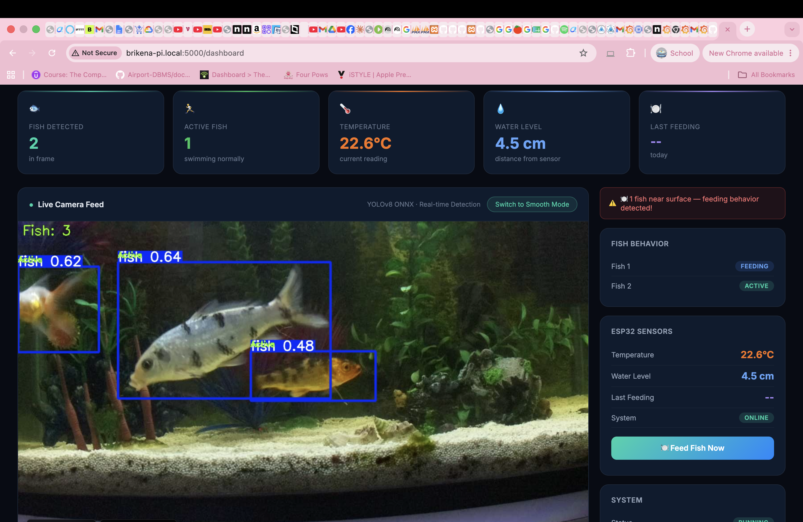
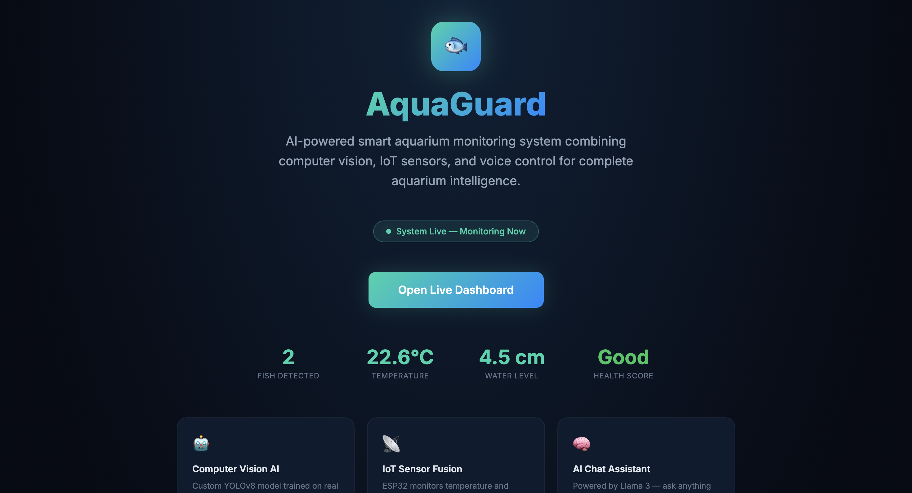
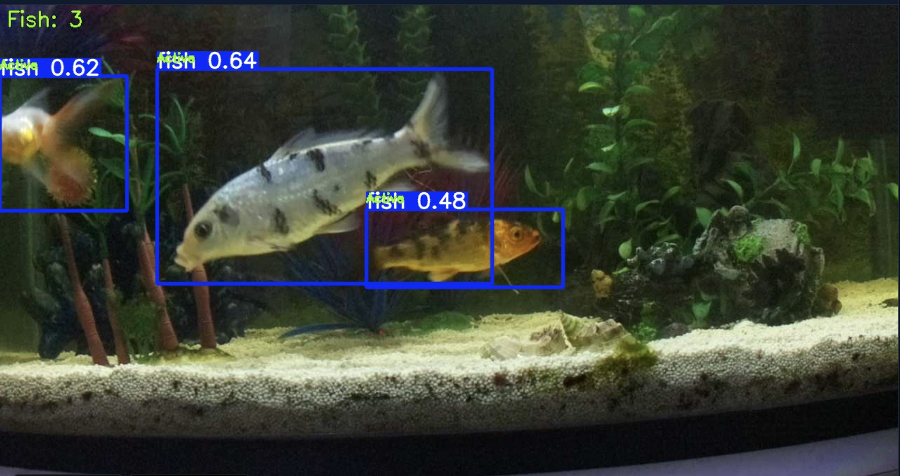

# 🐟 AquaGuard — Smart Aquarium Intelligence

> An AI-powered smart aquarium monitoring system combining computer vision, IoT sensors, voice control, and cloud analytics into a single unified platform.



[](https://python.org)
[](https://ultralytics.com)
[](https://flask.palletsprojects.com)
[](https://influxdata.com)
[](LICENSE)

---

## 🎬 Demo

[](YOUR_VIDEO_LINK_HERE)

> Click the image above to watch the full demo video

---

## ✨ Features

### 🤖 Computer Vision & AI
- **Custom YOLOv8 model** trained on 326 real aquarium images
- **Real-time fish detection** with bounding boxes and confidence scores
- **Behavior analysis** — classifies each fish as Active, Idle, or Feeding
- **ONNX Runtime** inference for optimized performance on Raspberry Pi 4
- **Smooth mode** — raw camera stream for fluid video without AI processing

### 📡 IoT Sensor Fusion
- **DS18B20 temperature sensor** — monitors water temperature every 10 seconds
- **HC-SR04 ultrasonic sensor** — monitors water level continuously
- **SG90 servo motor** — automatic fish feeding
- **ESP32** microcontroller handling all sensor operations
- Data sent to **InfluxDB Cloud** in real time

### 🧠 AI Assistant
- Powered by **Llama 3** (Groq API)
- Answers natural language questions using live aquarium data
- Knows fish count, behavior, temperature, water level, feeding history
- Context-aware responses based on real-time sensor readings

### 🎤 Voice Control
- **Amazon Alexa** integration via custom skill
- Ask about fish status, temperature, health
- Trigger feeding with voice command
- Works from anywhere — not limited to local network

### 📊 Analytics Dashboard
- Live camera feed with AI detection overlay
- Real-time fish count and individual behavior status
- ESP32 sensor readings — temperature, water level, last feeding
- Historical charts — temperature and water level over 24 hours
- Live fish activity graph
- Daily health summary — activity percentage, average temperature, health score

### 📱 Mobile Support
- Progressive Web App (PWA) — installable on any phone
- Fully responsive design — works on all screen sizes
- Feed fish button accessible from dashboard
- Real-time data updates every 2 seconds

### 🔔 Smart Alerts
- **Telegram notifications** when all fish are idle
- **Blynk push notifications** for high/low temperature
- **Blynk alerts** when water level drops too low
- Dashboard alert banner for real-time warnings

### 🍽️ Automated Feeding
- **Automatic feeding at 7:30 AM** every day via NTP time sync
- Manual feeding from dashboard with one click
- Manual feeding from Blynk mobile app
- Manual feeding via Alexa voice command
- Every feeding event logged to InfluxDB with timestamp

### 📄 Weekly Reports
- Automatic PDF report generated every Monday at 8:00 AM
- Sent via email automatically
- Contains temperature analysis, feeding history, activity summary, health score

---

---

## 🛠️ Hardware

| Component | Description | Purpose |
|-----------|-------------|---------|
| Raspberry Pi 4 Model B (8GB) | Main compute board | AI inference, web server, camera processing |
| ESP32 DEVKIT V1 | Microcontroller | Sensor reading, servo control |
| HQ Pi Camera + ArduCam 6mm IR lens | Camera module | Live video stream |
| DS18B20 | Waterproof temperature sensor | Water temperature monitoring |
| HC-SR04 | Ultrasonic distance sensor | Water level monitoring |
| SG90 | Micro servo motor | Automatic fish feeding |
| Amazon Echo | Smart speaker | Voice control interface |

---

## 💻 Tech Stack

### Hardware & Embedded
- **Raspberry Pi 4** — Edge AI compute
- **ESP32** — IoT sensor hub
- **Arduino IDE** — ESP32 firmware

### Computer Vision & ML
- **YOLOv8 nano** — Object detection
- **ONNX Runtime** — Optimized inference
- **OpenCV** — Video processing
- **Ultralytics** — Model training

### Backend
- **Python 3.13** — Main language
- **Flask** — Web server
- **Threading** — Concurrent camera and AI processing

### Cloud & IoT
- **InfluxDB Cloud** — Time series database
- **Grafana** — Data visualization
- **Blynk** — Mobile IoT dashboard
- **Telegram Bot API** — Push notifications

### AI & Voice
- **Groq API** (Llama 3) — AI chat assistant
- **Alexa Skills Kit** — Voice control
- **AWS Lambda** — Alexa skill backend

### Infrastructure
- **systemd** — Auto-start services
- **ngrok** — Public URL tunnel
- **PWA** — Mobile app support

---

## 📁 Project Structure
aquaguard/
├── app_final20.py          # Main Flask application
├── template.html           # Dashboard UI
├── landing.html            # Landing page
├── report.py               # Weekly PDF report generator
├── static/
│   ├── manifest.json       # PWA manifest
│   ├── icon-192.png        # App icon
│   └── icon-512.png        # App icon large
├── best.onnx               # Trained YOLOv8 model
├── fish_project/           # Training data and scripts
│   ├── images/             # Training images (326 total)
│   ├── labels/             # YOLO format labels
│   ├── train.py            # Model training script
│   ├── split_dataset.py    # Dataset splitting script
│   └── data.yaml           # Training configuration
└── arduino/
└── aquaguard_esp32.ino # ESP32 firmware

---

## 🚀 Installation

### Prerequisites
- Raspberry Pi 4 (4GB or 8GB RAM recommended)
- Raspberry Pi OS (64-bit)
- Python 3.11+
- ESP32 with sensors connected

### 1. Clone the repository
```bash
git clone https://github.com/yourusername/aquaguard.git
cd aquaguard
```

### 2. Create virtual environment
```bash
python3 -m venv venv
source venv/bin/activate
```

### 3. Install dependencies
```bash
pip install flask ultralytics opencv-python numpy \
            influxdb-client groq requests reportlab \
            schedule yagmail
```

### 4. Configure credentials
Create a `.env` file or update the configuration in `app_final20.py`:
```python
INFLUX_URL = "your-influxdb-url"
INFLUX_TOKEN = "your-token"
TELEGRAM_TOKEN = "your-telegram-bot-token"
TELEGRAM_CHAT_ID = "your-chat-id"
GROQ_API_KEY = "your-groq-key"
```

### 5. Flash ESP32
Open `arduino/aquaguard_esp32.ino` in Arduino IDE and update:
```cpp
char ssid[] = "your-wifi-name";
char pass[] = "your-wifi-password";
String influxToken = "your-influx-token";
```

### 6. Run the application
```bash
python3 app_final20.py
```

### 7. Set up auto-start (optional)
```bash
sudo cp aquaguard.service /etc/systemd/system/
sudo systemctl enable aquaguard
sudo systemctl start aquaguard
```

---

## 📸 Screenshots

### Dashboard


### Mobile App


### Landing Page


### Fish Detection


---

## 🎯 Model Training

The YOLOv8 model was trained on a custom dataset:

- **326 labeled images** of goldfish in real aquarium conditions
- **Images captured** from multiple angles and lighting conditions
- **Training split:** 80% train, 20% validation
- **Base model:** YOLOv8 nano (pretrained on COCO)
- **Training:** 50 epochs on Apple M4
- **Export:** ONNX format for Raspberry Pi compatibility

```bash
cd fish_project
python3 train.py
python3 -c "from ultralytics import YOLO; YOLO('best.pt').export(format='onnx')"
```

---

## 📊 Performance

| Metric | Value |
|--------|-------|
| Detection FPS | 3-5 FPS (Pi 4, CPU only) |
| Model size | ~6MB (ONNX) |
| Inference time | ~200ms per frame |
| Camera resolution | 1280x720 |
| Sensor update interval | 10 seconds |
| Dashboard refresh | 2 seconds |

---

## 🔮 Future Work

- [ ] Individual fish identification using appearance embeddings
- [ ] Fish disease detection (Ich, fin rot, bloating)
- [ ] Automatic water refill with pump relay
- [ ] Water pH and turbidity sensors
- [ ] React Native mobile app
- [ ] Fish anomaly detection using Isolation Forest
- [ ] Multi-aquarium support
- [ ] Public cloud hosting

---

## 👩‍💻 Author

**Brikena Shaqiri**
- 3rd year Computer Science (Software Engineering)
- South East European University, Tetovo, North Macedonia
- GitHub: [@yourusername](https://github.com/brikenashaq)

---

## 🏫 Academic Context

This project was developed as part of the **IoT (CCE-802)** course at South East European University. It demonstrates the integration of edge AI, IoT sensor networks, cloud computing, and voice interfaces into a complete smart monitoring system.

---

## 🙏 Acknowledgments

- [Ultralytics](https://ultralytics.com) for YOLOv8
- [Groq](https://groq.com) for Llama 3 API
- [InfluxData](https://influxdata.com) for InfluxDB Cloud
- [Blynk](https://blynk.io) for IoT dashboard
- South East European University

---

*Built with ❤️ for fish everywhere 🐟*
